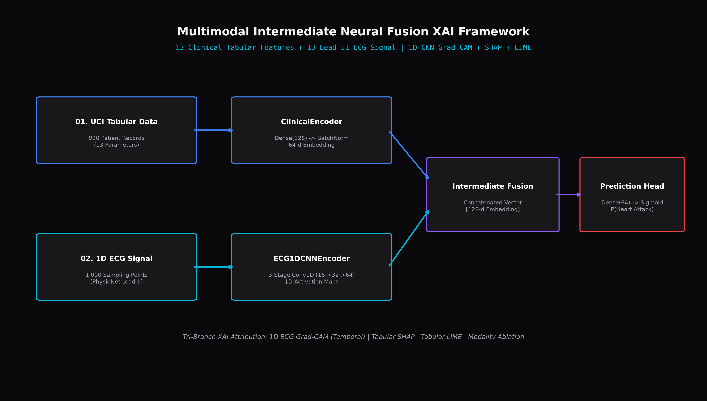

# 🔬 SHAP vs LIME: Explainable AI Suite & Interactive Dashboard

Academic lab project for the **Explainable Artificial Intelligence (23AM501)** course, CSE (AI & ML), Sri Krishna College of Technology.

---

## 📐 System Architecture



---

## 🌟 Overview

This repository presents a comprehensive Explainable AI (XAI) framework comparing **SHAP (SHapley Additive exPlanations)** and **LIME (Local Interpretable Model-agnostic Explanations)**. The project evaluates model predictions on a **Random Forest Classifier** trained on the **Wine Dataset** through both static analytical notebooks and a **full-stack interactive web application**.

### Key Features
* 📊 **Dataset & Model Engineering**: Stratified classification problem analyzing 13 chemical properties of wine samples.
* 🌎 **Global Interpretability**: SHAP summary beeswarm plots, mean absolute Shapley feature ranking, and feature dependence interaction analysis.
* 🎯 **Local Interpretability**: Real-time side-by-side comparison of local SHAP attributions (Waterfall charts) and LIME surrogate linear model decision rules.
* 🔍 **Uncertainty & Borderline Case Study**: Automated identification and dissection of high-uncertainty instances (predictions closest to 50% probability).
* 💻 **Interactive Full-Stack Dashboard**: Built with **React, Vite, and Tailwind CSS** for the frontend, powered by a **Flask REST API** backend.

---

## 🚀 Getting Started & How to Run

### One-Click Launch

#### On Windows (PowerShell):
```powershell
.\start.ps1
```

#### On Linux / macOS / Git Bash:
```bash
./start.sh
```

Once launched, open your browser to interact with the suite:
* 🌐 **Frontend Dashboard**: `http://localhost:5173`
* ⚡ **Flask API Engine**: `http://localhost:5000`

---

## 📁 Repository Structure

```
├── SHAP_LIME_Lab.ipynb       # Main Jupyter notebook containing analytical experiments
├── server.py                 # Flask REST API server exposing explanation endpoints
├── app.py                    # Streamlit dashboard implementation
├── frontend/                 # React + Vite + Tailwind CSS web dashboard source code
│   ├── src/App.jsx           # Interactive dashboard layout & Recharts visual components
│   └── src/index.css         # Custom glassmorphism styles and Tailwind CSS directives
├── xai_framework_diagram.png # High-resolution system architectural framework diagram
├── xai_framework_diagram.pdf # PDF format of the architectural diagram
├── start.ps1                 # One-click startup script for PowerShell
├── start.sh                  # One-click startup script for Bash
└── requirements.txt          # Python dependencies
```

---

## 📊 Framework Comparison Matrix

| Attribute | SHAP (Shapley Additive exPlanations) | LIME (Local Interpretable Model-agnostic Explanations) |
|---|---|---|
| **Theoretical Basis** | Cooperative Game Theory (Shapley values) | Local Surrogate Linear Models |
| **Consistency** | Deterministic & mathematically consistent | Stochastic (varies slightly between perturbation runs) |
| **Computation Speed** | Moderate to Slow (TreeSHAP optimized for trees) | Fast (local neighborhood sampling) |
| **Explanation Scope** | Global + Local explanations | Primarily Local explanations |
| **Axiomatic Guarantees**| Efficiency, Symmetry, Dummy, Additivity | Heuristic-based, no formal guarantees |

---

## 🛠️ Tech Stack

* **Machine Learning & XAI**: Python, `scikit-learn`, `shap`, `lime`, `pandas`, `numpy`, `matplotlib`
* **Backend API**: Flask, Flask-CORS
* **Frontend Web App**: React, Vite, Tailwind CSS, Recharts, Lucide Icons

---

## 🎓 Course Context

Built as a hands-on lab to understand explainable AI techniques — a vital requirement in modern machine learning systems where model predictions must be transparent, interpretable, and auditable for real-world deployment.
